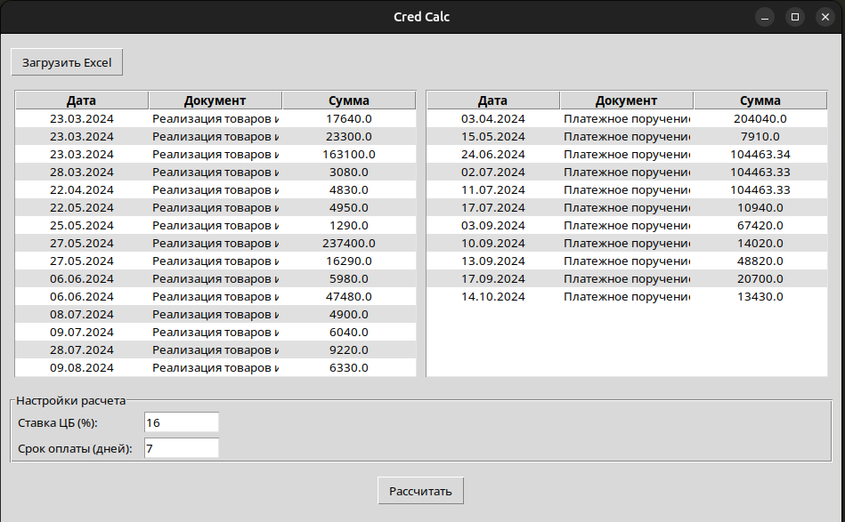
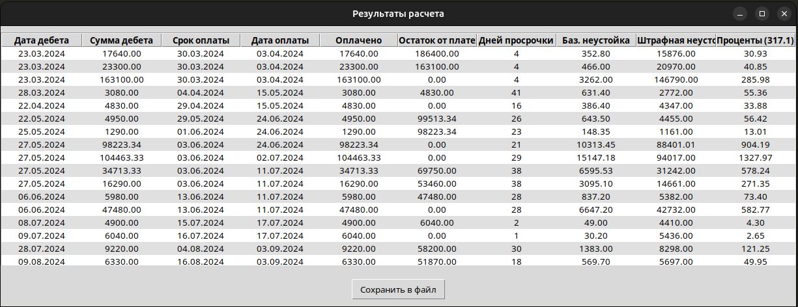

# Cred Calculator

📊 Cred Calculator — инструмент для автоматизированного расчёта:

- 💸 неустойки по договору  
- 📅 процентов за просрочку по статье 317.1 Гражданского кодекса РФ  
- ⚖️ штрафных санкций при нарушении сроков оплаты

Программа предназначена для юристов, бухгалтеров, финансовых специалистов и аналитиков, работающих с актами сверки и дебиторской задолженностью.

## Main sreen


## Calculation sreen


---

## 🚀 Возможности

- автоматическое сопоставление реализаций и оплат (квитирование)
- расчёт остатка долга по каждой операции
- определение количества дней просрочки
- расчёт трёх типов санкций:
  - договорная неустойка
  - штрафная (фиксированная) неустойка
  - проценты по 317.1 ГК РФ
- вывод результата в виде структурированных данных, готовых к экспорту

---

## 🛠️ Стек технологий

- Python 3.12
- tkinter
- pandas — для парсинга и работы с табличными данными
- decimal — для точных финансовых расчётов
- dataclasses — для описания структур расчётов
- pytest — модульное тестирование
- PyInstaller — для сборки исполняемого файла

---

## 📥 Формат входного файла

Программа принимает на вход Excel-файл или таблицу, в которой содержатся реализации и оплаты, представленные в единой структуре.

*Входной файл должен быть без заголовков, указаных в примере*

### Структура входных данных:

| Дата      | Документ   | Дебет    | Кредит    |
|-----------|------------|----------|-----------|
| 23.03.2025| Реализация | 17640.00 | NULL      |
| 23.03.2025| Реализация | 23300.00 | NULL      |
| 23.03.2025| Реализация | 163100.0 | NULL      |
| 23.03.2025| Платеж. п. | NULL     | 204040.00 |

- Дебет is not null — это реализация (дебет)
- Кредит is not null — значит, это платежное поручение

Программа автоматически разделяет данные на дебеты и кредиты, сортирует их по дате и сопоставляет оплаты с долгами в хронологическом порядке.

---

## 📊 Пример выходных данных

После выполнения расчётов программа формирует список `MatchedPayment`, 
который может быть экспортирован в таблицу или просмотрен в интерфейсе.  
Пример:

| Дата дебета | Сумма дебета | Дата оплаты | Дата кредита | Оплачено | Остаток    | Просрочка (дн.) | Базовая неустойка | Штрафная неустойка | Проценты |
|-------------|--------------|-------------|--------------|----------|------------|-----------------|-------------------|--------------------|----------|
| 23.03.2024  | 17640.00     | 30.03.2024  | 03.04.2024   | 17640.00 | 0.00       | 4               | 35.13             | 15876.50           | 7.74     |
| 28.03.2024  | 3080.00      | 04.04.2024  | 03.04.2024   | 3080.00  | 0.00       | 0               | 0.00              | 2772.00            | 0.00     |

---

## ⚙️ Компиляция проекта

Для сборки проекта используется [PyInstaller](https://pyinstaller.org/).

### 🐧 Linux

1. Запустите команду:
    ```bash
    make build
    ```

2. Бинарный файл лежит по пути:
    ```bash
    dist/cred_calc
    ```

🪟 Windows

1. Установить зависимости:
   ```bash
   pip install pyinstaller
   ```
2. Запустить копиляцию:
   ```bash
    pyinstaller --onefile --windowed --name cred_calc main.py
   ```
3. Бинарный файл лежит по пути:
    ```bash
    dist/cred_calc.exe
    ```
  
